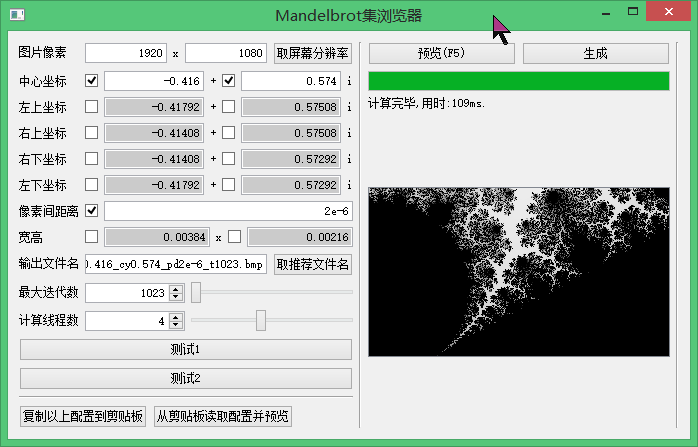
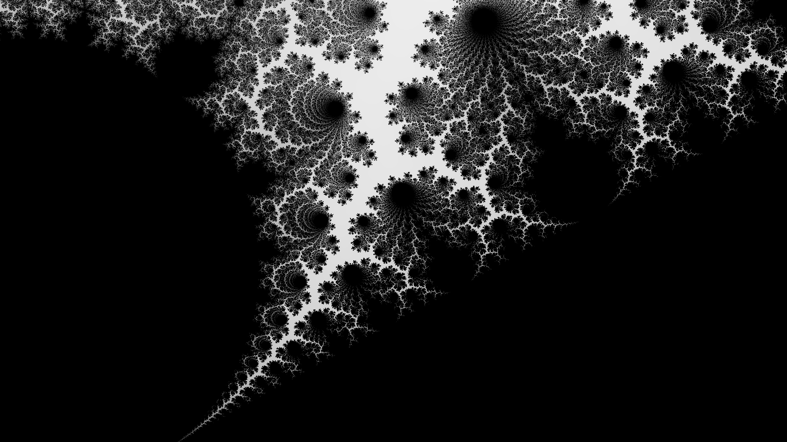

# MandelbrotSetViewer

曼德勃罗集图像生成器（其实是壁纸生成器）

# 环境

使用Qt Creator 4.6.1 with Qt4开发。编译器使用安装Qt4时附带的mingw-GCC 4.4.0。

# 特性

支持多线程绘制，配置导入导出，历史绘制等。

计算使用double型变量，在像素间距低于1e-16级时，会有明显的马赛克；分辨率大约在1e-18级。

# 窥视



配置串：

```
{M_1920x1080_cx-0.416_cy0.574_pd2e-6_t1023}
```
生成效果：



# 计划

添加着色器脚本插件，增加JuliaSet浏览乃至迭代式插件。

解耦图形API与绘图数据。
